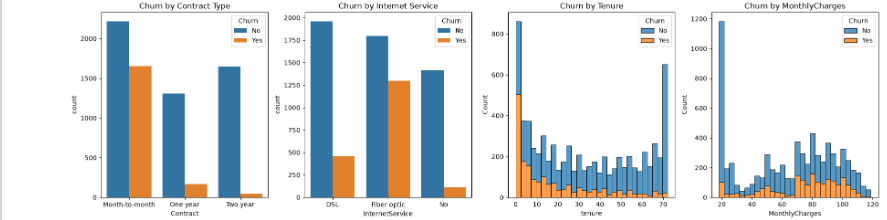
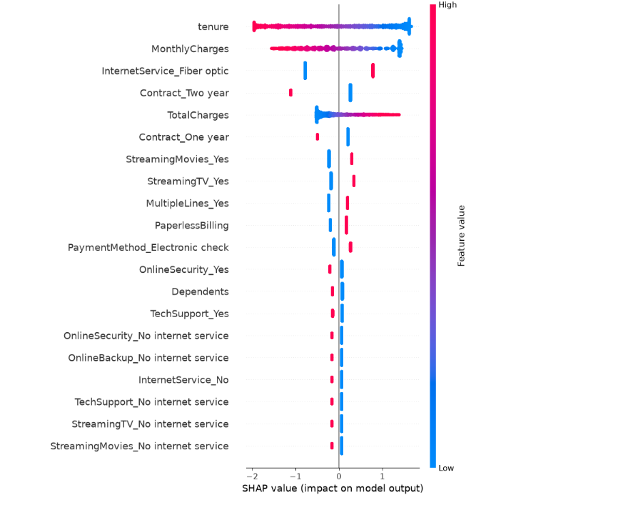

# Customer Churn Prediction

An end-to-end machine learning project that predicts whether a telecom customer will churn (cancel their subscription), served through a containerized REST API.

This project covers the full ML lifecycle: data cleaning → exploratory analysis → model comparison → hyperparameter tuning → explainability (SHAP) → deployment (FastAPI + Docker).

## Problem Statement

Customer churn directly impacts recurring revenue. Identifying which customers are at risk of leaving — and *why* — allows a business to target retention efforts where they matter most, instead of guessing.

This project uses the [Telco Customer Churn dataset](https://www.kaggle.com/datasets/blastchar/telco-customer-churn) (7,043 customers, 21 features) to build a model that predicts churn probability for a given customer profile.

## Key EDA Findings



- **Contract type matters most.** Month-to-month customers churn at a much higher rate than one-year or two-year contract customers — no surprise, since longer contracts lock customers in.
- **Fiber optic customers churn more** than DSL or no-internet customers, despite being the "premium" service — likely tied to higher pricing.
- **New customers are highest risk.** Churn is heavily concentrated in the first ~10 months of tenure, then drops sharply for long-tenured customers.
- **Higher monthly bills correlate with higher churn.** Customers on cheap, bare-minimum plans rarely leave; customers paying more churn more often.

**Takeaway:** the highest-risk segment is *new customers on month-to-month, fiber optic, higher-priced plans* — retention efforts should focus there first.

## Model Comparison

Three models were trained and evaluated on accuracy, F1 score, and ROC-AUC. F1 was prioritized as the primary metric since the target classes are imbalanced (~73% No / 27% Yes).

| Model | Accuracy | F1 Score | ROC-AUC |
|---|---|---|---|
| **Logistic Regression** | 80.7% | **0.609** | 0.842 |
| Random Forest | 78.4% | 0.542 | 0.823 |
| XGBoost (default) | 77.6% | 0.553 | 0.818 |
| XGBoost (tuned, GridSearchCV) | 79.8% | 0.570 | 0.845 |

**Logistic Regression was selected as the final model.** XGBoost was tuned via `GridSearchCV` (36 hyperparameter combinations, 5-fold cross-validation) to rule out "it just needed tuning" as an explanation — even after tuning, Logistic Regression still won on F1, the metric that matters most here.

This suggests the relationship between customer features and churn is largely linear/additive rather than requiring complex non-linear interactions, which lines up with the EDA: contract type, tenure, and pricing each independently drive churn risk rather than interacting in complicated ways.

## Explainability (SHAP)



SHAP values confirm what the EDA suggested, but quantified per-prediction:

- **Low tenure** (blue) pushes predictions toward churn; **high tenure** (red) pushes toward retention.
- **High MonthlyCharges** pushes toward churn; low charges push toward retention.
- **Having fiber optic internet** pushes toward churn.
- **Having a two-year contract** strongly pushes toward retention.

Every major EDA finding is independently validated by the model itself — not just visual inspection.

## Tech Stack

- **Data cleaning & EDA:** Python, Pandas, Matplotlib, Seaborn
- **Modeling:** scikit-learn (Logistic Regression, Random Forest), XGBoost
- **Explainability:** SHAP
- **API:** FastAPI
- **Deployment:** Docker

## Project Structure

```
churn-prediction/
├── app/
│   ├── main.py              # FastAPI app
│   ├── churn_model.pkl      # Trained model
│   ├── scaler.pkl           # Feature scaler
│   └── model_columns.pkl    # Expected feature columns/order
├── Churn.ipynb               # Full notebook: EDA, modeling, tuning, SHAP
├── Dockerfile
├── requirements.txt
└── README.md
```

## Running Locally with Docker

```bash
# Build the image
docker build -t churn-api .

# Run the container
docker run -p 8000:8000 churn-api
```

Once running, open `http://127.0.0.1:8000/docs` for the interactive API documentation (Swagger UI), where you can test the `/predict` endpoint directly.

### Example Request

```json
POST /predict
{
  "gender": "Female",
  "SeniorCitizen": 0,
  "Partner": "Yes",
  "Dependents": "No",
  "tenure": 5,
  "PhoneService": "Yes",
  "MultipleLines": "No",
  "InternetService": "Fiber optic",
  "OnlineSecurity": "No",
  "OnlineBackup": "No",
  "DeviceProtection": "No",
  "TechSupport": "No",
  "StreamingTV": "Yes",
  "StreamingMovies": "Yes",
  "Contract": "Month-to-month",
  "PaperlessBilling": "Yes",
  "PaymentMethod": "Electronic check",
  "MonthlyCharges": 85.5,
  "TotalCharges": 450.0
}
```

### Example Response

```json
{
  "churn_prediction": "Yes",
  "churn_probability": 0.7926
}
```

## Future Improvements

- Pin exact dependency versions in `requirements.txt` for full reproducibility
- Add a feature store and drift monitoring to extend this into a production-style MLOps pipeline
- Add automated tests and a CI/CD pipeline (GitHub Actions) to auto-validate model performance before deployment


